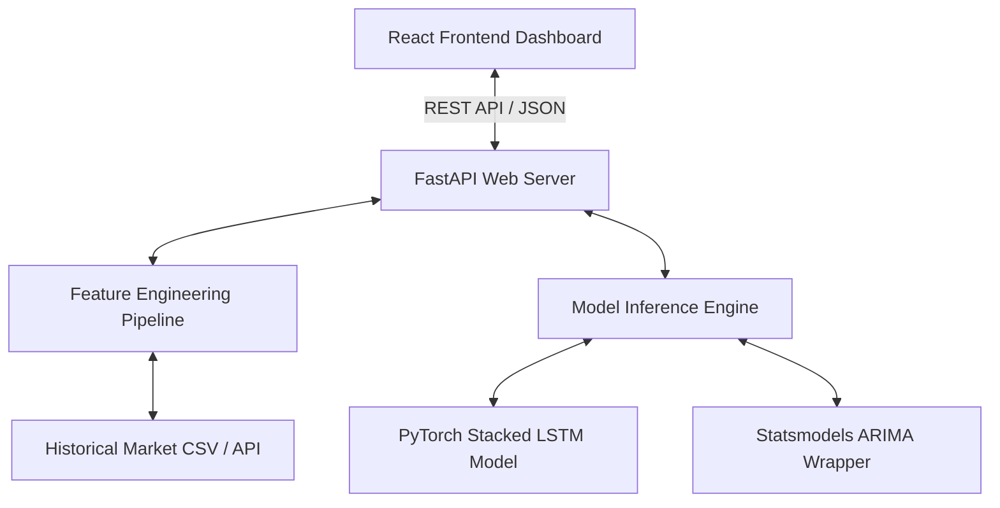

# Asset Price Prediction Platform

An end-to-end time series prediction platform combining deep learning sequential models (LSTM) and classical statistical autoregressive models (ARIMA/SARIMA). Built as a professional, production-ready project showcasing feature engineering, asynchronous REST API serving, and interactive data visualization.

---

## 📈 System Architecture

The application is structured as a decoupled client-server system containerized with Docker:



1. **Frontend (React + Recharts):** Responsive, Vercel-inspired dark minimalist interface providing ticker selection (AAPL, BTC-USD, MSFT), parameter configuration (forecast horizon, rolling indicators), and comparative graphs.
2. **Backend (FastAPI):** Asynchronous API router coordinating data loading, running rolling feature calculations (SMA, EMA, RSI, Volatility), and invoking the model inference engine.
3. **Machine Learning Core:**
   - **Stacked LSTM (PyTorch):** Captures non-linear dependencies across temporal windows.
   - **ARIMA (Statsmodels):** Serves as a classical linear statistical baseline, modeling auto-correlations and trends.
   - **Feature Engineering Pipeline:** Computes indicators on the fly:
     - **Relative Strength Index (RSI):** $100 - \frac{100}{1 + RS}$
     - **Simple Moving Average (SMA):** $\frac{1}{N}\sum_{i=0}^{N-1} P_{t-i}$
     - **Exponential Moving Average (EMA):** $P_t \cdot \alpha + EMA_{t-1} \cdot (1 - \alpha)$

---

## 📂 Repository Structure

```
Asset-Price-Prediction-Platform/
├── backend/
│   ├── models/
│   │   ├── arima_model.py     # Statsmodels ARIMA inference wrapper
│   │   └── lstm_model.py      # PyTorch Stacked LSTM model definition & weight loader
│   ├── utils/
│   │   └── data_pipeline.py   # Feature engineering: SMA, EMA, RSI, Volatility calculation
│   ├── main.py                # FastAPI app setup and routing
│   ├── requirements.txt       # Python backend dependencies
│   └── Dockerfile             # Container configuration for backend
├── frontend/
│   ├── public/
│   │   └── index.html         # Client entry point HTML
│   ├── src/
│   │   ├── components/
│   │   │   └── Dashboard.jsx  # Interactive chart & control panels
│   │   ├── App.css            # Dark modern styles
│   │   ├── App.jsx            # Main app router/shell
│   │   └── main.jsx           # React app bootstrap
│   ├── package.json           # Node client dependencies
│   └── vite.config.js         # Vite compilation setups
├── README.md                  # Comprehensive platform documentation
└── docker-compose.yml         # Multi-container orchestration configurations
```

---

## 🛠️ Tech Stack

* **Backend:** Python 3.10, FastAPI, Uvicorn, PyTorch (Deep Learning), Statsmodels (ARIMA), Pandas, NumPy, Scikit-learn
* **Frontend:** React 18, Vite, Recharts (Data Visualization), Lucide Icons, CSS3 (Vanilla glassmorphism style)
* **Ops:** Docker, Docker Compose

---

## 🚀 Getting Started

### Prerequisites
* Docker & Docker Compose **or**
* Python 3.10+ and Node.js 18+

### Setup using Docker Compose (Recommended)
From the root of the project:
```bash
docker-compose up --build
```
* **Frontend Dashboard:** `http://localhost:5173`
* **FastAPI Backend Swagger Docs:** `http://localhost:8000/docs`

### Manual Setup (Local Development)

#### 1. Backend Service
```bash
cd backend
python -m venv venv
source venv/Scripts/activate # On Windows: venv\Scripts\activate
pip install -r requirements.txt
python main.py
```
Starts backend on `http://localhost:8000`.

#### 2. Frontend Client
```bash
cd ../frontend
npm install
npm run dev
```
Starts development server on `http://localhost:5173`.

---

## 🔌 API Reference

### 1. Get Available Tickers
* **Endpoint:** `GET /api/tickers`
* **Response:**
```json
["AAPL", "BTC-USD", "MSFT"]
```

### 2. Fetch Historical & Forecasted Metrics
* **Endpoint:** `GET /api/forecast`
* **Query Parameters:**
  - `ticker` (string, default: `AAPL`): Asset symbol.
  - `model` (string, default: `lstm`): Prediction model (`lstm` or `arima`).
  - `horizon` (int, default: `10`): Forecasting window steps (days).
* **Response:**
```json
{
  "ticker": "AAPL",
  "model": "lstm",
  "history": [
    { "date": "2026-05-15", "price": 172.50, "sma": 170.12, "rsi": 58.4 },
    { "date": "2026-05-16", "price": 174.10, "sma": 171.05, "rsi": 62.1 }
  ],
  "forecast": [
    { "date": "2026-05-17", "price": 175.25, "lower_bound": 173.10, "upper_bound": 177.40 },
    { "date": "2026-05-18", "price": 176.40, "lower_bound": 174.00, "upper_bound": 178.80 }
  ]
}
```

---

## 🔬 ML Core Details

### 1. Stacked LSTM Sequence Modeling
The LSTM model is composed of two stacked recurrent layers with 64 hidden units each, followed by a fully connected output projection layer:
* **Inputs:** Multi-dimensional sliding windows of shape `(batch_size, sequence_length, input_features)` where input features include: `[Normalized Close, Volatility, RSI]`.
* **Sequence Length:** 30 time steps (representing the past month of pricing indicators).
* **Inference Pipeline:** Runs sequence-to-sequence state transitions, mapping cell gates to roll prediction steps recursively into the forecasted future.

### 2. Autoregressive Statistical Forecasts
ARIMA computes autoregressive correlations to provide linear trend confidence intervals:
* **Parameters:** Fits an $ARIMA(p, d, q)$ order. We optimize the parameter combination using the Akaike Information Criterion (AIC):
  $$AIC = 2k - 2\ln(\hat{L})$$
* **Output:** Returns forecasted paths along with standard error matrices mapping to 95% confidence bounds.
