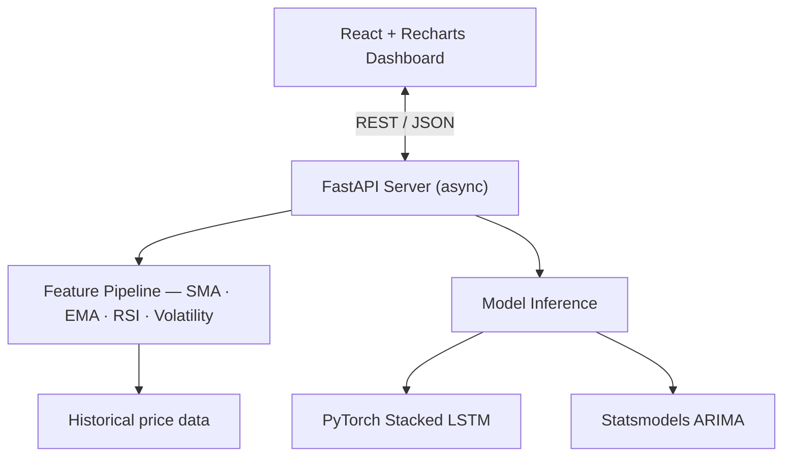

# Asset Price Prediction Platform


An end-to-end time-series forecasting platform that puts a **deep-learning sequence model (LSTM)**
and a **classical statistical model (ARIMA)** side by side on the same asset-price data — so you
can see where each approach wins. A FastAPI backend computes rolling technical indicators on the
fly and serves multi-step forecasts to an interactive React dashboard.

## Why I built this
To explore the boundary between classical autoregressive forecasting and recurrent deep learning:
where does an LSTM's ability to model non-linear dependencies actually beat a well-fit ARIMA, and
what does it cost in complexity? Building it also meant designing a clean, decoupled service —
feature pipeline, model inference, REST API, dashboard — rather than a notebook.

## Architecture


```mermaid
graph TD
    Client["React + Recharts Dashboard"] <-->|REST / JSON| API["FastAPI Server (async)"]
    API --> Pipe["Feature Pipeline — SMA · EMA · RSI · Volatility"]
    API --> Infer["Model Inference"]
    Infer --> LSTM["PyTorch Stacked LSTM"]
    Infer --> ARIMA["Statsmodels ARIMA"]
    Pipe --> Data["Historical price data"]
```

## Key features
- **Two model families, one interface** — switch between `lstm` and `arima` per request.
- **On-the-fly feature engineering** — SMA, EMA, RSI, volatility computed per query (no leakage).
- **Async FastAPI** serving history + multi-step forecast with confidence bounds.
- **Containerized** with Docker Compose for one-command, environment-parity startup.

## Tech stack
**Backend:** Python 3.10, FastAPI, Uvicorn, PyTorch, Statsmodels, Pandas, NumPy
**Frontend:** React, Vite, Recharts · **Ops:** Docker, Docker Compose

## Getting started

```bash
# Recommended — Docker Compose (from repo root)
docker-compose up --build
# Frontend → http://localhost:5173   ·   API docs → http://localhost:8000/docs
```

<details><summary>Manual setup</summary>

```bash
# Backend
cd backend && python -m venv venv && source venv/Scripts/activate   # Windows: venv\Scripts\activate
pip install -r requirements.txt && python main.py        # → http://localhost:8000

# Frontend
cd ../frontend && npm install && npm run dev              # → http://localhost:5173
```
</details>

## API
`GET /api/forecast?ticker=AAPL&model=lstm&horizon=10` → returns historical points (price, SMA, RSI)
plus a forecast path with lower/upper bounds. Full interactive docs at `/docs`.

## Notes
The LSTM is a 2-layer stack (64 hidden units, 30-step window over `[close, volatility, RSI]`);
ARIMA orders are selected by AIC. Deployment configs included for Vercel (frontend) and Render
(backend) via `vercel.json` / `render.yaml`.

> _Add a dashboard screenshot/GIF here — recommended before sharing with recruiters._
